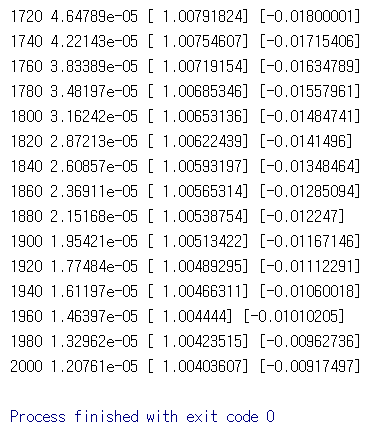
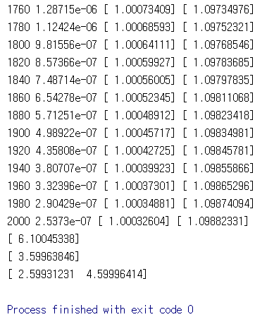
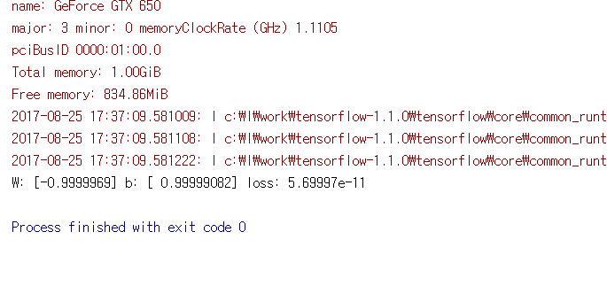

# 2. Linear Regression

이 코드들은 TensorFlow로 linear regression의 기본적인 사용 방법을 구현하였습니다.

---
## 2.1 lab-02-1-linear_regression.py

지정한 x, y 값을 이용하여 linear regression을 진행합니다.

#### 실행 결과

## 2.2 lab-02-2-linear_regression_feed.py

X, Y를 지정하지 않고 placeholder로 선언하여 그래프를 실행할 때 feed_dict를 통하여 값을 지정하는 방법의 linear regression입니다.

#### 실행 결과

## 2.3 lab-02-3-linear_regression_feed.py

feed_dict로 x, y에 미리 지정해둔 x_train, y_train data 값을 넣어주는 방법의 linear regression 코드입니다.

#### 실행 결과

