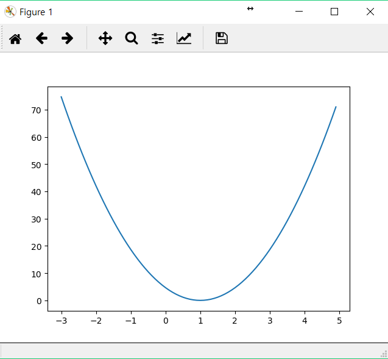
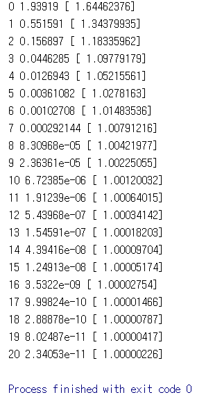
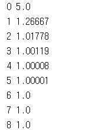
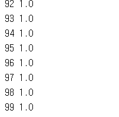
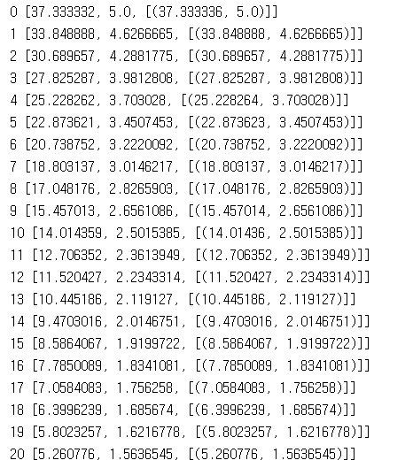
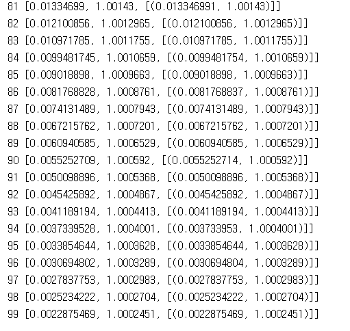

# 3. Minimizing Cost

이 코드들은 TensorFlow로 linear regression의 cost를 최소화하는 방법을 구현하였습니다.
---
## 3.1 lab-03-1-minimizing_cost_show_graph.py

3-1

#### 실행 결과

## 3.2 lab-03-2-minimizing_cost_gradient_update.py

3-2

#### 실행 결과

## 3.3 lab-03-3-minimizing_cost_tf_optimizer.py

3-3

#### 실행 결과

## 3.4 lab-03-X-minimizing_cost_tf_gradient.py

3-4

#### 실행 결과

