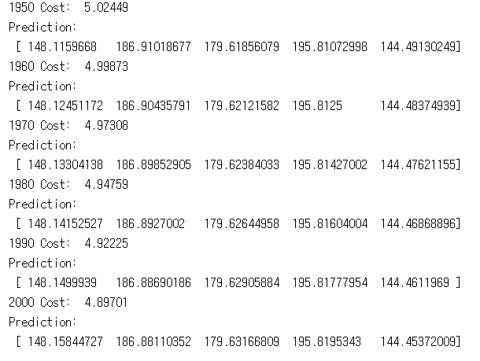
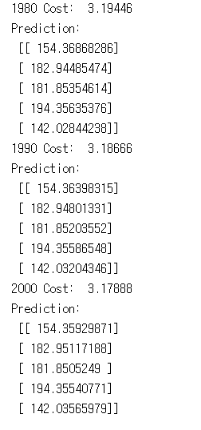
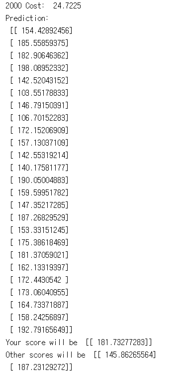
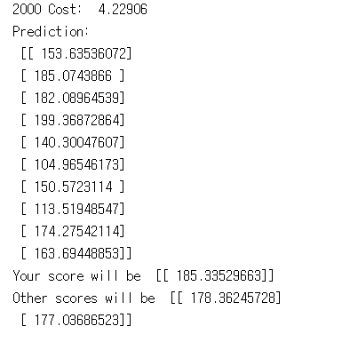

# 4. Multi-variable linear regression

이 코드들은 TensorFlow로 linear regression의 cost를 최소화하는 방법을 구현하였습니다.
---
## 4.1 lab-04-1-multi_variable_linear_regression.py

4-1

#### 실행 결과

## 4.2 lab-04-2-multi_variable_matmul_linear_regression.py

4-2

#### 실행 결과

## 4.3 lab-04-3-file_input_linear_regression.py

4-3

#### 실행 결과

## 4.4 lab-04-4-tf_reader_linear_regression.py

4-4

#### 실행 결과

