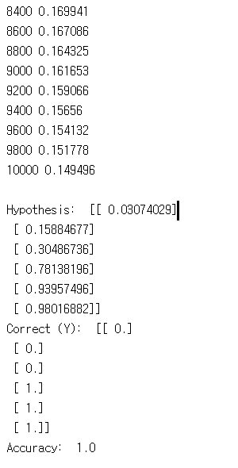
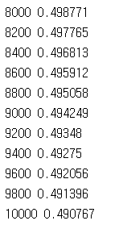
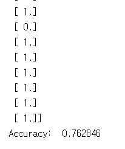

# 5. Logistic (regression) classifier

이 코드들은 TensorFlow로 linear regression의 cost를 최소화하는 방법을 구현하였습니다.
---
## 5.1 lab-05-1-logistic_regression.py

5-1

#### 실행 결과

## 5.2 lab-05-2-logistic_regression_diabetes.py

5-2

#### 실행 결과

