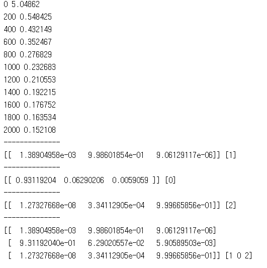
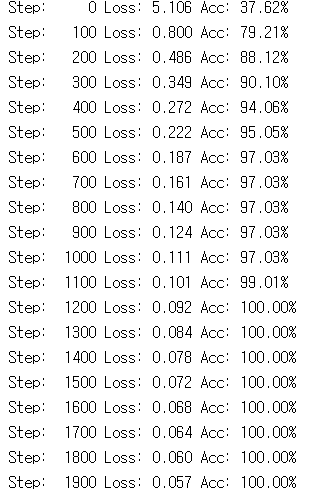
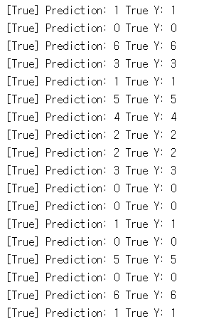

# 6. Softmax Classifier

lab06 실습 코드들은 arg_max와 softmax함수의 사용법에대하여 설명하고 있다.

---
## 6.1 lab-06-1-softmax_classifier.py

6-1은 softmax와 arg_max를 이용하여 학습된 모델 중 가장 큰 값의 index를 불러오는 코드입니다.

#### 실행 결과

## lab-06-2-softmax_zoo_classifier.py

6-2은 data-04-zoo.csv를 불러와 7개의 class에 대하여 softmax 함수와 arg_max를 이용하여 분류하고 accuracy를 측정하는 코드입니다.

#### 실행 결과

