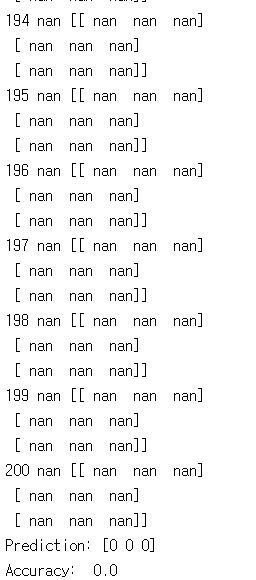
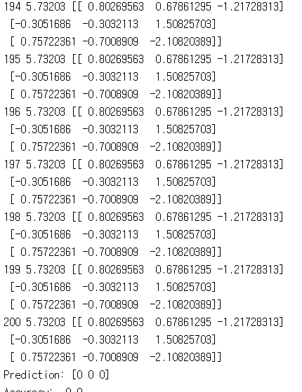
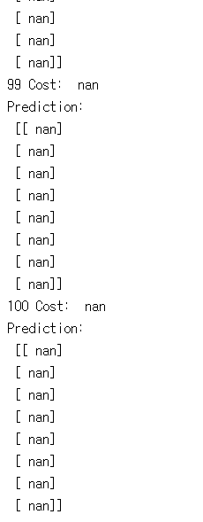
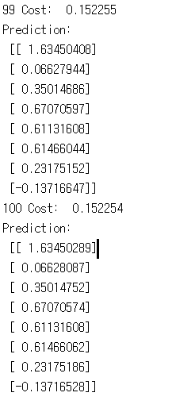
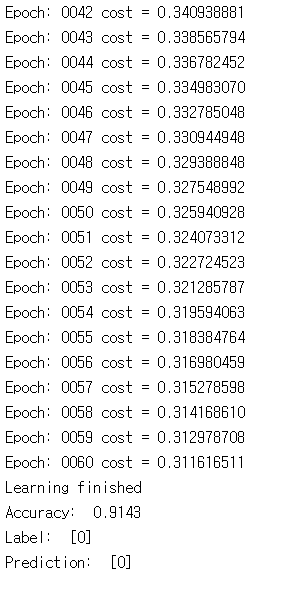

# 7. Learning rate, Evaluation, MNIST

lab07에서 사용하는 코드로 learning rate에 따른 cost값의 변화를 확인해 보고 MNIST 예제를 한 번 실행해 봅시다.

---
## 7.1 lab-07-1-learning_rate_and_evaluation.py

7-1은 learning rate의 변화에 따라 cost 값이 어디로 수렴하는지 혹은 발산하는 지 확인할 수 있습니다.

#### 실행 결과

learning rate = 1.5

learning rate = 0.1

learning rate = e-10

## 7.2 lab-07-2-linear_regression_without_min_max.py

7-2는 linear_regression을 사용할 때 min max scaler를 사용하지 않은 경우 어떻게 결과가 나오는 지 확인해 볼 수 있다.

#### 실행 결과

## 7.3 lab-07-3-linear_regression_min_max.py

7-3은 min max scaler를 사용하여 데이터 값에 적용 시켜 입력 데이터 값을 0~1사이로 normalize 하여 error의 크기를 줄일 수 있고 그로 인한 결과를 확인할 수 있다.

#### 실행 결과

## 7.4 lab-07-4-mnist_introduction.py

7-4은 우리가 7장까지 실습해본 것들을 종합하여 mnist 예제를 실행해 보는 코드입니다.

#### 실행 결과

