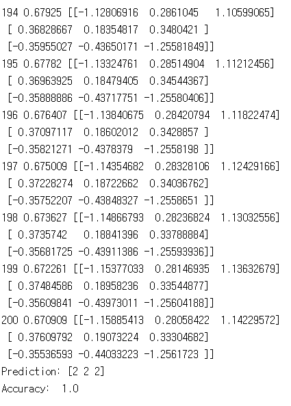

# 4. Multi-variable linear regression

이 코드들은 TensorFlow로 linear regression의 cost를 최소화하는 방법을 구현하였습니다.
---
## 7.1 lab-07-1-learning_rate_and_evaluation.py

7-1

#### 실행 결과

## 7.2 lab-07-2-linear_regression_without_min_max.py

7-2

#### 실행 결과

## 7.3 lab-07-3-linear_regression_min_max.py

7-3

#### 실행 결과

## 7.4 lab-07-4-mnist_introduction.py

7-4

#### 실행 결과

