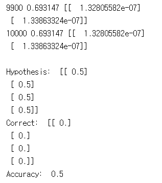
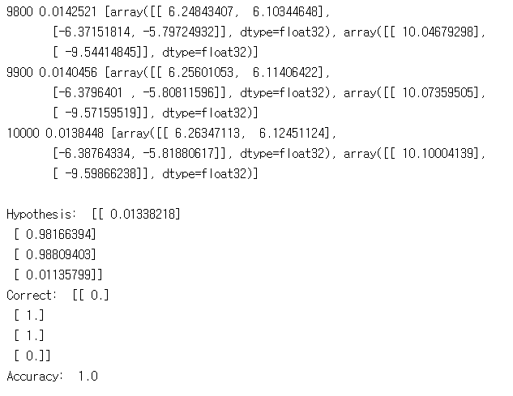
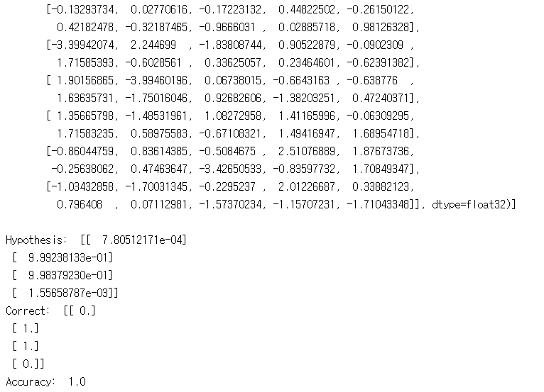
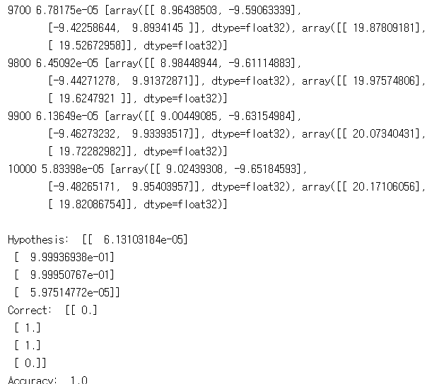

# 9. NN for XOR, TensorBoard, BackProp

---
## 9.1 lab-09-1-xor.py

9-1은

#### 실행 결과

## 9.2 lab-09-2-xor-nn.py

9-2는

#### 실행 결과

## 9.3 lab-09-3-xor-nn-wide-deep.py

9-3은

#### 실행 결과

## 9.4 lab-09-4-xor_tensorboard.py

9-4은

#### 실행 결과

