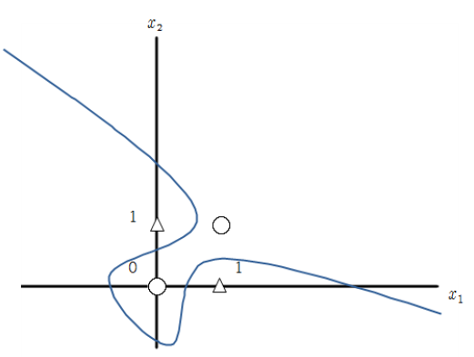

# 9. NN for XOR, TensorBoard, BackProp

AND와 OR은 선형으로 구분할 수 있으며 매우 쉽게 구현할 수 있지만 XOR의 경우 구분하기 위해서는 비선형 구분을 해야하며 이를 어떻게 Neural Network를 사용해서 구현하는 지 알아보는 실습 시간입니다. 그리고 Tensorboard를 통하여 어떻게 학습되는지 과정을 확인할 수 있습니다.

---
## 9.1 lab-09-1-xor.py

9-1은 단층 perceptron 구조를 이용하여 XOR을 구현하는 코드입니다. 하지만 결과를 확인하면 단층 구조로 비선형 구분을 할 수 없는 것을 확인할 수 있ㅅ븐디ㅏ.

#### 실행 결과

## 9.2 lab-09-2-xor-nn.py

9-2는 층수를 2층으로 늘려 Neural Net을 만들어 XOR을 구현하는 코드입니다. 비선형 구분을 할 수 있음을 알 수 있습니다.

#### 실행 결과

## 9.3 lab-09-3-xor-nn-wide-deep.py

9-3은 Neural Net에서 간단한 XOR 문제를 Deep하고 wide하게 구현한 것이며 층수가 많아질수록 deep하며 shape의 모양이 급격하게 변하지 않는 것이 wide한 것입니다. 결과가 어떻게 나오는 지 확인해 봅시다.

#### 실행 결과

## 9.4 lab-09-4-xor_tensorboard.py

9-4은 9-2의 네트워크 구조에서 Weight1과 2의 Histogram을 tensorboard를 통해 확인할 수 있는 코드입니다.

#### 실행 결과

