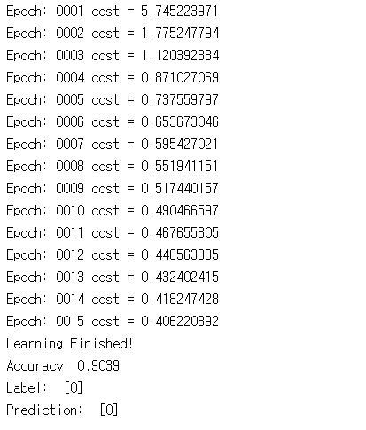
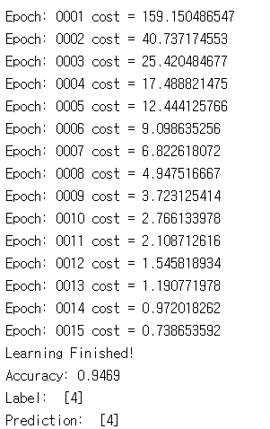
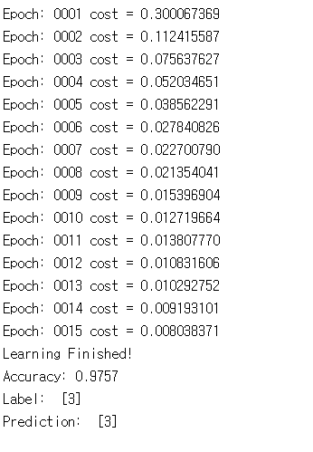
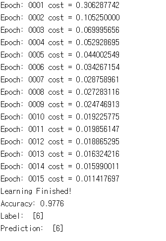
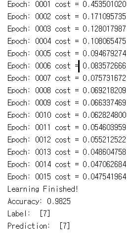

# 10. NN, ReLu, Xavier, Dropout, and Adam

이번 실습 10장은 MNIST를 이용한 Neural Network 구성을 확인해보고 실습할 수 있습니다. ReLu, Xavier, Dropout 그리고 Adam optimizer을 각각 추가해가면서 Accuracy가 어떻게 변하는 지 확인하고 개념을 이해하며 진행하길 바랍니다. 

10.1부터 11.2까지 Training~Test 과정이 같고 주석은 10.1과 10.2에만 적어 놓았으니 참고 바랍니다.

---
## 10.1 lab-10-1-mnist_softmax.py

10-1은 MNIST를 가장 단순한 단층 perceptron을 통하여 accuracy를 알아보는 코드입니다. cost함수는 softmax를 사용할 때 쓰는 function을 tf.nn.softmax_cross_entropy_with_logits를 사용하여 정의하였습니다.

Test 시 r값에 랜덤한 example number가 들어가는 데 직접 원하는 숫자를 지정해 보아도 되며 OpenCV 혹은 matplotlib을 통해 이미지를 출력하여 확인해볼 수 있습니다.

#### 실행 결과

## 10.2 lab-10-2-mnist_nn.py

10-2는 W1부터 W3까지 3층 Neural Network를 이용하였을 때  accuracy가 어떻게 변하는 지 확인할 수 있습니다.

#### 실행 결과

## 10.3 lab-10-3-mnist_nn_xavier.py

10-3은 처음 Weight와 bias들을 initialize할 때 가우시안 분포에 따른 값으로 initializing하는 것이 아닌 Xavier 방법으로 initialize하여 성능을 좀 더 이끌어 낸 코드입니다. Xavier initializer의 경우 강의에서 잘 설명되어 있습니다.

#### 실행 결과

## 10.4 lab-10-4-mnist_nn_deep.py

10-4은 층을 5개로 늘렸을 때 결과가 어떻게 변하는 지 확인할 수 있습니다.

#### 실행 결과

## 10.5 lab-10-5-mnist_nn_dropout.py

10-5은 dropout 기법 (keep_prob를 통해 조절)을 이용하여 성능이 어떻게 변하는 지 확인할 수 있ㅅ브니다.

#### 실행 결과

## 10.6 lab-10-6-mnist_nn_batchnorm.ipynb

10-6은 batch normalization에 대한 코드입니다. 쥬피터 노트북으로 되어 있으며 코드를 통해 간단하게 분석해 보세요.