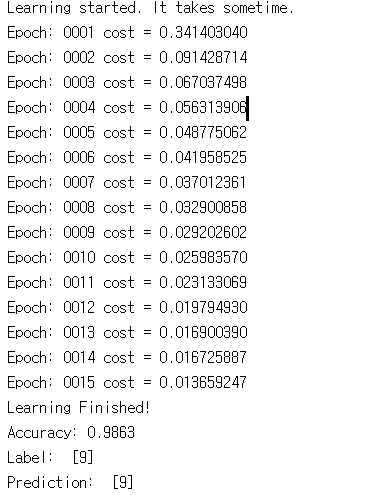
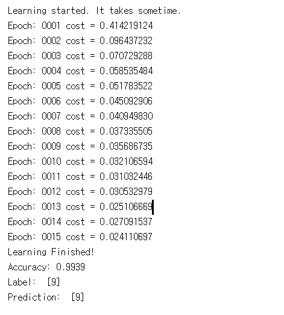
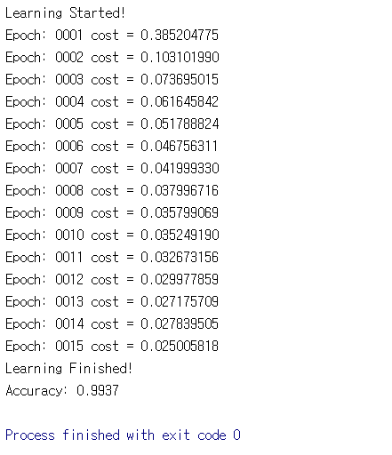
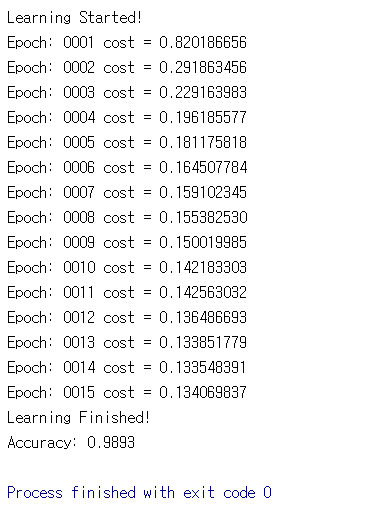
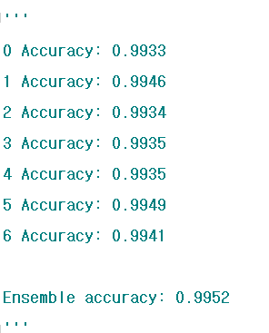

# 11. CNN

10장은 Neural Network와 여러가지 성능 향상 방법을 배웠습니다. 이번 11장 실습에서는 MNIST를 CNN을 이용하여 성능을 측정해 보며 어떻게 CNN을 설계하는 지 알아 봅시다.

---
## 11.0 lab-11-0-cnn_basics.ipynb

11-0은 cnn의 기본에 대하여 그림을 통해 잘 설명되어 있습니다. 한 번 읽어보는 것을 추천합니다.

## 11.1 lab-11-1-mnist_cnn.py

11-1은 CNN구조를 이용하여 MNIST 이미지를 flat한 상태가 아닌 28*28의 상태로 입력에 넣어 Training을 하는 코드 입니다.

#### 실행 결과

## 11.2 lab-11-2-mnist_deep_cnn.py

11-2는 11-1의 3층구조의 CNN에서 좀 더 deep한 5층 구조의 Network로 Convolutional Neural Network Training을 진행한 것입니다. 시간이 꽤 걸리며 성능이 어떻게 다른지 확인해 봅시다.

#### 실행 결과

## 11.3 lab-11-3-mnist_cnn_class.py

11-3은 네트워크를 class로 지정하여 좀 더 편하고 관리하기 쉽게 만든 코드입니다. 이러한 방법도 있다는 것을 참고해 주시면 됩니다.

#### 실행 결과

## 11.4 lab-11-4-mnist_cnn_layers.py

11-4는 TensorFlow에 기본적으로 가지고 있는 layers라는 class의 method들을 사용하여 Network를 설계하는 법을 알 수 있습니다. 11-3처럼 class를 구성하였고 구성 방법에 layers class를 사용하였습니다.

#### 실행 결과

## 11.5 lab-11-5-mnist_cnn_ensemble_layers.py

11-5은 강의에서 배운 앙상블 코드를 구현할 수 있습니다. 같은 구조의 네트워크들을 여러개 학습을 시켜 놓은 뒤 합치는 것으로 앙상블 코드를 구현할 수 있습니다.

#### 실행 결과

