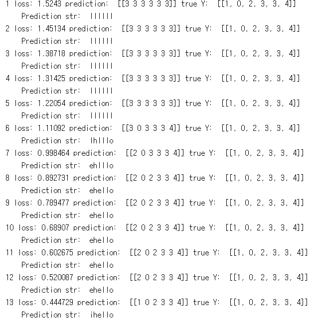
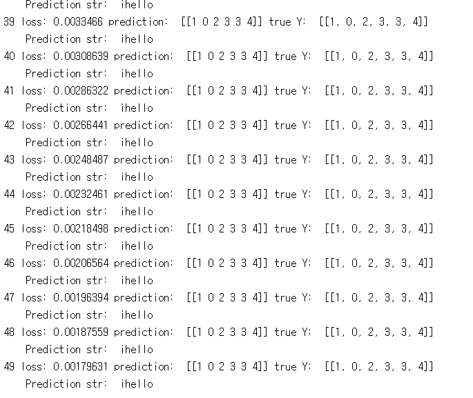
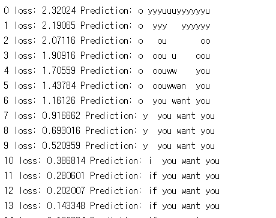
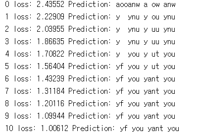
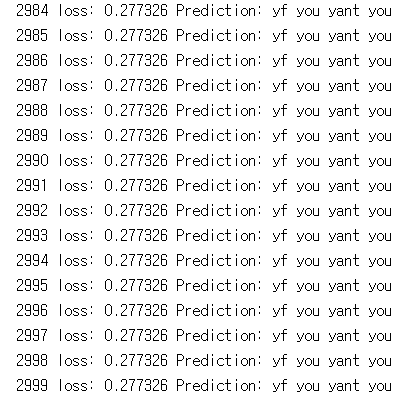
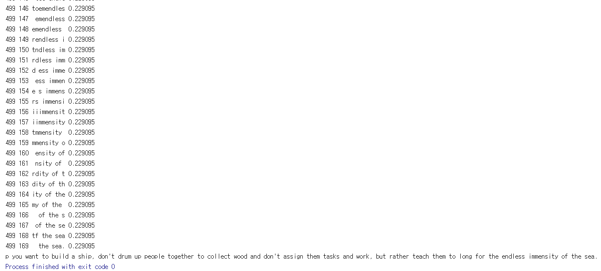
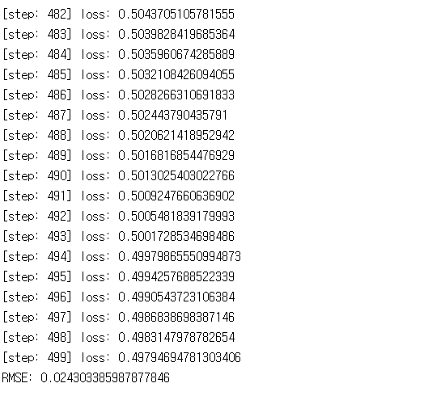

# 12. RNN

12장에서는 CNN이 아닌 RNN에 대하여 다룰 것입니다. 보통 영상, 이미지 보다는 음성, 텍스트 등에 더 많이 사용된다고 하며 코드를 통해 RNN의 기초에 대해서 배워봅시다.

---
## 12.0 lab-12-0-rnn_basics.ipynb

12-0부터 이해하기 힘들 수 있습니다. 글자를 어떤 식으로 나누며 RNN의 데이터에 사용 되는 지 간단하게 살펴봅시다.
 
## 12.1 lab-12-1-hello_rnn.py

12-1은 h, i, e, l, o를 통해 hello라는 문자를 출력할 수 있도록 학습하는 코드이며 결과가 ihello로 나오는 것을 확인할 수 있습니다. 하지만 hello 맨 앞에 i가 같이 출력되는 오류를 확인할 수 있습니다.

#### 실행 결과

## 12.2 lab-12-2-char-seq-rnn.py

12-2는 단어 하나가 아닌 문장을 조합하는 것을 RNN을 통하여 학습하고 결과를 확인할 수 있는 코드입니다.

#### 실행 결과

## 12.3 lab-12-3-char-seq-softmax-only.py

12-3은 12-2에서 softmax만 사용한 결과를 확인할 수 있습니다. softmax만 사용한 경우와 아닌 경우 둘 다 어떻게 다른지 확인해 봅시다.

#### 실행 결과

## 12.4 lab-12-4-rnn_long_char.py

12-4는 긴  문장을 RNN을 이용하여 학습하고 찾는 방법을 사용한 코드입니다.

#### 실행 결과

## 12.5 lab-12-5-rnn_stock_prediction.py

단어 찾기와 유사하게 RNN을 이용하여 RMSE로 결과를 나타내는 코드입니다.

#### 실행 결과

